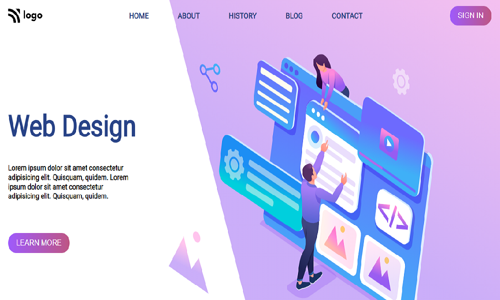

## Live Class Project 8

# Web Design Homepage

### Concepts Learnt 

- Using linear gradient to set background color.
- How to use both flexbox and position properties to set different images inside a container.

Time taken to finish this project is 3 hours.
Took 1 hour to make this page responsive for small,medium and large size screen.

[netlify link](https://live-project-webdesign-page.netlify.app/)

